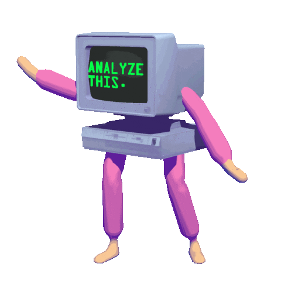
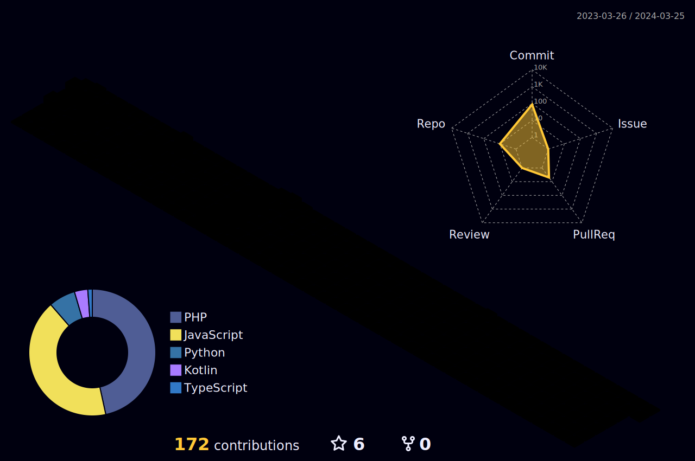
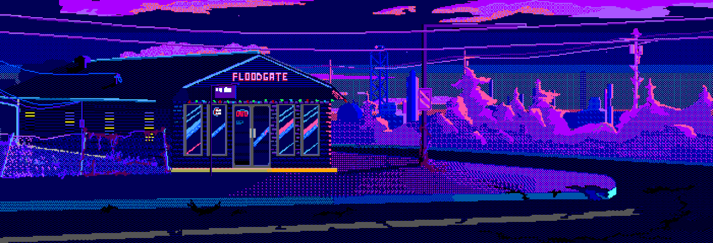

<!--   my-icons -->
<p align="center">
    <a href="https://github.com/bardiotmarin/bardiotmarin"></a>
    
</p>

<!--   my-header-img -->

 <a href="lien vers mon portefolio"></a> 


<!--   my-ticker -->    
[](https://git.io/typing-svg)

<codersrank-summary username="bardiotmarin"></codersrank-summary>

<!--   my-kaggle     
### My achievements on [kaggle](https://www.kaggle.com/andrej0marinchenko):


-->


<!--   my-skils -->

| Property                                        | Data                                                                                                                                                                                                                                                                                                                                                                                                                                                                                                                                                                                                                                                                                                                                                                                                                                                                                                                                                                                                                                                                                                                                                                                                                                                                                                                                                                                                                                                                                                                                                                                                                                                                                                                                                                                                      |
|-------------------------------------------------|-----------------------------------------------------------------------------------------------------------------------------------------------------------------------------------------------------------------------------------------------------------------------------------------------------------------------------------------------------------------------------------------------------------------------------------------------------------------------------------------------------------------------------------------------------------------------------------------------------------------------------------------------------------------------------------------------------------------------------------------------------------------------------------------------------------------------------------------------------------------------------------------------------------------------------------------------------------------------------------------------------------------------------------------------------------------------------------------------------------------------------------------------------------------------------------------------------------------------------------------------------------------------------------------------------------------------------------------------------------------------------------------------------------------------------------------------------------------------------------------------------------------------------------------------------------------------------------------------------------------------------------------------------------------------------------------------------------------------------------------------------------------------------------------------------------------|

| **DevOps / Cloud & CI/CD** |          |


| **Languages**                              |            |                                                                                                                                                                                                                                                                                                                                                                                                                                                                                                                                                                                                                                                                    |
| **IDE / CMS**                              |        |                                                                                                                                                                                                                                                                                                                                                                                                                                                                                                                                                                                                                                                                                                                                                                                                                                                                                                                                                                                                                                                                |
| **Domain Knownledge**                           |  [](https://github.com/search?q=user%3ABEPb&type=Repositories) [](https://github.com/bardiotmarin?tab=repositories)                                                                                                                                                                                                                                                                                                                                                                                                                                                                                                                                                                                                                                                                                                                                                                                                                                                                                                                                                                                                                                                                                      |
| **CI / CD**                                     | [](https://github.com/bardiotmarin/bardiotmarin) [](https://github.com/BEPb/BEPb) [](https://github.com/bardiotmarin/bardiotmarin)                                                                                                                                                                                                                                                                                                                                                                                                                                                                                                                                                                                                                                                                                                                                                                                                                                                                                                                                                                                                                                                                                                                                                                                                                                                                                                                                                                                                                                                                                                                                                                                             
| **CLOUD**                           |                                                                                                                                                                                                                                                                                                                                                                                                                                                                                                                                                                                                                                                                                                                                                                                                                                                                                                                                                                 |
| **Databases**                                   |                                                                                                                                                                                                                                                                                                                                                                                                                                                                                                                                                                                                                                                                                                                                                                                                                                                                                                                                                    |
| **OS**                                          | <a target="_blank" rel="noopener noreferrer" href="https://camo.githubusercontent.com/b44114213a5a462903bd69611bb6846f1dc41fe6f3230bd37c67c3d4eb65f08c/68747470733a2f2f696d672e736869656c64732e696f2f62616467652f2d57696e646f77732d626c61636b3f7374796c653d666c61742d737175617265266c6f676f3d77696e646f7773266c6f676f436f6c6f723d626c7565"></a> <a target="_blank" rel="noopener noreferrer" href="https://camo.githubusercontent.com/9c4bc049e33f41f122342a1714ccf872c34098a9f2c593c33c2322cf0129fa04/68747470733a2f2f696d672e736869656c64732e696f2f62616467652f2d5562756e74752d626c61636b3f7374796c653d666c61742d737175617265266c6f676f3d7562756e7475"></a>                                                                                                                                                                                                                                                                                                                                                                                                                                                                                                                                                                                                                                                                                                                                                                                                                                                                                                                                                                                                                                                                                                                                                                                                                                                                                                                                                                                                                                                                                                                                                                                           |
| **Tools & Platform**                            |                                                                                                                                                                                                                                                                                                                                                                                                                                                                                                                                                                                                                                                                                                                                                                                                                                                                                                                                                                                                                                                                                                                                                                                                                                                                                               |
| **frameworks** |                   |                                                                                                                                                                                                                                                                                                                                                                                                                                                                                                                                                                                                                                                                                                                                                                                                                                                                                                                                                                                                                                                                                                                                                                                                                                                                                                                                                                                                                                                                                                                                 |                                                                                                                                                 
| **Design / Video**                   |    	                                                                                                                                                                                                                                                                                                                                                                                                                                                                                                                                                                                                                                                                                                                                                                                                                                                                                                                                                 |                                                                                                                                                                                                                                                    
| **Audio**                       |    |                                                                                                                                                                                                                                                                                                                                                                                                                                                                                                                                                                                                                                                                                                                      
 ###       
 
  
### 📈 GitHub Activity Graph:

<div align="center">      
    
| .                                                                                                                                       | .                                                                                                                         |
|-----------------------------------------------------------------------------------------------------------------------------------------|---------------------------------------------------------------------------------------------------------------------------|
|    |  |

<br/>

<!--   profile-green-animate -->


<!--   grid-snake -->


<!--   skyline -->
<a href="https://skyline.github.com/bardiotmarin/2023"></a>


## 2d history skills
</img>

</div>

<div align="center">

## 🏆GitHub Trophies

</div>


<div align="center">
    ## 🏆Trophy: codersrank.io
    
</div>

<codersrank-summary username="bardiotmarin"></codersrank-summary>
<p align="center"> 

 ###       

### 📫 How to Reach me:
<p align="left">
<a href="mailto:bardiot.marin@gmail.com" target="blank"></a>
<a href="https://api.whatsapp.com/send?phone=+33601012962" alt="Connect on Whatsapp">  </a>
</p>

## 🌐Socials
[](https://instagram.com/nebulabeatzgang) [](https://linkedin.com/in/https://www.linkedin.com/in/marin-bardiot-bab9211a6/) [](https://youtube.com/c/https://www.youtube.com/channel/UCy8GfYhe7F6sytjqK4XqwKw) 
</p>

<p align="right">
🍷 France - My Home 🥖
</p>

 ```geojson  
{
 "type": "FeatureCollection",
 "features": [
   {
     "type": "Feature",
     "id": 1,
     "properties": {
       "ID": 0
     },
     "geometry": {
       "type": "Polygon",
       "coordinates": [
         [
             [-5.2, 42.0],
             [9.6, 42.0],
             [9.6, 51.1],
             [-5.2, 51.1],
             [-5.2, 42.0]
         ]
       ]
     }
   }
 ]
}


```


<!--- <p align="center"> 


</p>
-->


#### Thanks for visiting :heart:

<p align="center"> 
  

counting of visitors to this page in this section started from July 25, 2023
<a href="https://info.flagcounter.com/lQ2Z"></a>


## 🌠 Star History

[](https://star-history.com/#Bbardiotmarin/bardiotmarin&Date)


### Profile Views
counting of visitors in my github profil started from July 25, 2023


</br>


</p>

---
  *If you liked my profile, you can Star ⭐ the repo and if you want to use this template you can Fork it and can use.* 
---
Would you talk to meet me?

If you want to contribute to any of my repositories, feel free to submit PRs, issues and email me. Pick a slot if you'd like to meet me and chat about proposals and ideas - but make sure to describe the agenda

<!---
  *I use an automatic subscription control system. Thus, everyone who subscribes to me, I will subscribe to those and I will respond, and vice versa, I will remove all those who unsubscribe from me from among those who should be followed.* 
--->
<div align="center">  
    
### ✍️ Dev Quote


</div>


---
[](https://visitcount.itsvg.in)
[MIT](LICENSE)

